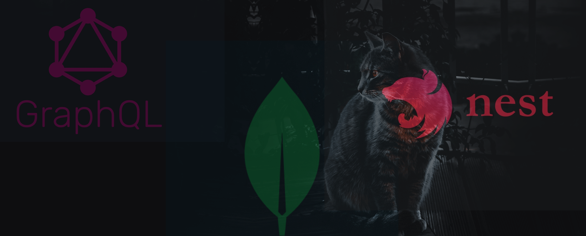

# Build a GraphQL API using NestJs and MongoDB - PART 1

<p align="center">
  <a href="http://nestjs.com/" target="blank"></a>
</p>

## Description

Are you ready to take your GraphQL development skills to the next level? In this series of four articles, I'll guide you through the process of building a powerful GraphQL API using Nest and MongoDB. You'll learn best practices, and see how to scale your app just as you would in a real-world scenario.

First, we'll kick things off by diving into the fundamentals of Nest, a powerful NodeJS framework. We'll set up the foundation for our final project, and by the end, you'll know how to manually deploy your own sample application.

Next, we'll delve into the world of Test Driven Development (TDD) for GraphQL. You'll see the benefits it brings to the development process and learn how to test your current resolvers and implement new ones using this approach.

In the third installment, we'll explore how to apply Continuous Integration and Continuous Deployment (CI/CD) to Nest and GraphQL apps. We'll create our pipelines and, building off the concepts from the second part, you'll see the true power of this approach in action. Once set up, you won't have to worry as much about delivering to the frontend team, and you'll be able to catch errors even before the app is shipped to client apps.

Finally, in the fourth and final installment, we'll take things up a notch by adding features that will introduce you to the world of micro-services. You'll learn how to break down your monolithic app into smaller, independent micro-services without disrupting any existing functionality. This is the modern approach, saving you from the headache of long, drawn-out migrations. So, let's get started and take your GraphQL development skills to the next level!

[Read the full article]()

## Installation

```bash
yarn install
```

## Running the app

```bash
# development
$ yarn run start

# watch mode
$ yarn run start:dev

# production mode
$ yarn run start:prod
```

## Test

```bash
# unit tests
$ yarn run test

# e2e tests
$ yarn run test:e2e

# test coverage
$ yarn run test:cov
```

## Say Hi

- Author - [Pacifique Linjanja](https://paclinjanja.tech)
- LinkedIn - [Pacifique Linjanja](https://www.linkedin.com/in/pacifique-linjanja/)
- Twitter - [@PacifiqueLinja1](https://twitter.com/PacifiqueLinja1)

## License

[MIT licensed](LICENSE).
